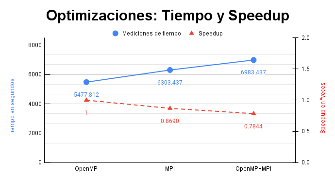
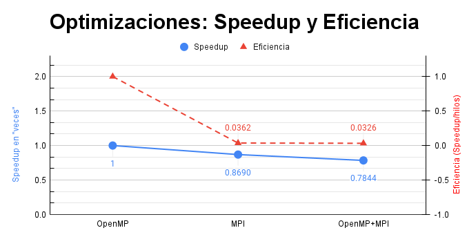

# **Heat transfer**

## Description of the problem

This project seeks to create a program that simulates the heat transfer that exists in a sheet (which can be of different materials) when exposed to constant temperatures from the edges. The program performs a concurrent implementation using OpenMP technology and distributed through MPI technology, implemented with C++ language.

The program allows to be called with different parameters, which make possible the customization of variables such as thermal diffusivity of the film to be simulated, the maximum temperature change that must exist between one state of the simulation and the next to consider that there is a stability, number of threads used.

The purpose of the program is that it can be executed with several jobs simultaneously on different computers, and with a higher degree of efficiency compared to serial solutions for this problem. Once the execution of the program is finished, a report with the obtained data is written in a file.

### Requirements

- **Job file:**

The job file (job file) is a text file that lists several slices and the simulation parameters that the experimenters want to investigate in each of them. The following is an example of a job file `job001.txt`:

~~~bash
plate001.bin 1200 127 1000 2
plate001.bin 1200 127 1000 1.5
plate002.bin 60 0.08 450 0.75
~~~

**Note**: the job file must have a name "job###.txt" where `###` is replaced by the job number. In the example above, `job001.txt` is used.

- **Sheet file**

Sheets are arrays that are stored in binary files that have a simple structure. The first eight bytes are an unsigned integer R indicating the number of rows in the matrix. The second eight bytes are an unsigned integer C indicating the number of columns in the matrix. From the previous 16 bytes, continue R⋅C double-precision floating numbers with the starting temperature of each of the cells in the matrix, in the usual row and column order. All values are in little-endian.

The parameters can be summarized as follows:

1. The name of the file containing the sheet in its initial state.
2. The desired duration Δt for each stage (in seconds).
3. The thermal diffusivity α of the material measured in units of area over time, e.g. $mm/s$.
4. The dimensions h of the cells measured in the same area units as the previous parameter but linear (distance).
5. The equilibrium point sensitivity ε, in the same temperature units as used in the foil file.

## User's manual

### Compilation

Use the following command: `make`  
Example:

~~~bash
[usr:Proyecto02]$ make
[user:Proyecto02]
mkdir -p build/
mpic++ -c -Wall -Wextra -fopenmp -g -std=gnu++17 -Isrc -MMD src/BINRead.cpp -o build/BINRead.o
mpic++ -c -Wall -Wextra -fopenmp -g -std=gnu++17 -Isrc -MMD src/Calculator.cpp -o build/Calculator.o
mpic++ -c -Wall -Wextra -fopenmp -g -std=gnu++17 -Isrc -MMD src/Communicator.cpp -o build/Communicator.o
.
.
.
mpic++ -Wall -Wextra -fopenmp -g -Isrc build/BINRead.o build/Calculator.o build/Communicator.o build/heatSim.o build/Matrix.o build/ProcessManager.o build/Reader.o build/Reporter.o build/Simulation.o build/SimulationManager.o -o bin/Proyecto02
[usr:Proyecto02]$
~~~

### Execution

To run the program you must call it from the terminal, using the command `mpiexec -np P -oversubscribe bin/Project02 path/jobFile.txt threadCount path` replacing: `P` with the desired number of processes, `path/jobFile.txt` with the path of the file you want to work with, `threadCount` with the number of threads required and `path` with the work path where the simulation data will be loaded and saved.

For example if the file containing the jobs to be performed is called `jobs002.txt` and you want to run it with 4 processes and 8 threads, the desired command would have the following form:

~~~bash
`mpiexec -np 4 -oversubscribe bin/Proyecto02 jobs/job002/job002.txt 8 jobs/job002`
~~~

Which would produce on console something similar to this:

~~~bash
[user:Proyecto02]
$ mpiexec -np 4 -oversubscribe bin/Proyecto02 jobs/job002/job002.txt 8 jobs/job002
Plate number: 000
Plate number: 003
Plate number: 004
Plate number: 001
Plate number: 006
Plate number: 007
Plate number: 005
Plate number: 002
process 0, time elapsed to finalize: X.XXXs
[user:Proyecto02]
~~~

### Output: Report File

The report file provides statistics resulting from running each simulation. Its name is in the form job###.tsv, where ### is the same number as the job file. Each time the simulation program is invoked, the corresponding report file is created or overwritten. The report file is text and has a similar format to the job file:

The file might look as follows:

~~~bash
plate001.bin  1200  127  1000  2  2  0000/00/00 00:40:00
~~~

Where _plate001.bin_ is the plate that was simulated, _1200_ the time t provided, _127_ the assigned thermal diffusivity, _1000_ the dimensions h of the cells, the _2_ is the equilibrium point sensitivity ε.

The two remaining data are those that provide us with the results of the simulations.

- The first one corresponds to the number of states k performed until the desired stability is reached. In the previous example, 2 states were needed for the first one.

- From last is the elapsed time kΔt until reaching said equilibrium point. The following notation YYYYY/MM/DD hh:mm:ss is used. So, the simulation took 40 minutes in this case.

---

### Performance Analysis

The following are the performance measurements of project 2, using the `job020` test case. The program was executed on the Arenal cluster in three versions with various number of processes and threads. A summary of the results obtained is presented below:

| Version:        | OpenMP    | MPI       | Hybrid    |
| :---            | ---:      | ---:      | ---:      |
| **Threads:**      | 8         | 1         | 8         |
| **Processes:**   | 1         | 24        | 3         |
| **Nodes:**      | 1         | 3         | 3         |
| **Duration:**   | 5477.812  | 6303.437  | 6983.918  |
| **Speedup:**    | 1         | 0.8690    | 0.7844    |
| **Efficiency:** | 1         | 0.0362    | 0.0327    |

From the table above you can see the performance and efficiency increase calculation of the MPI and Hybrid version with respect to OpenMP.

According to the data shown in the graphs, no increase in the expected performance according to the theory was achieved in either version.

This can be attributed to external factors such as cluster saturation, due to the collective use of the cluster at the time of testing. In addition, the program does not present a specialized optimization of the functions so the times could be improved with a debugging of the code.

As we can see, although the expected results were not obtained, it is possible to have an objective view of the work done in code and in the future to optimize it to obtain results close to the theoretical ones.

---

## Créditos

**Autores:**

| Name                        | contact                        |
| :---                        | :---                           |
| Zurisadai Granados Montoyo  | <zurisadai.granados@ucr.ac.cr>   |
| Maeva Murcia Melendez       | <valery.murcia@ucr.ac.cr>        |
| Fabián Orozco Chaves        | <fabian.orozcochaves@ucr.ac.cr>  |
| Ariel Solís Monge           | <ariel.solismonge@ucr.ac.cr>     |

---

Otras rutas:

[Readme del diseño](design/README.md)
