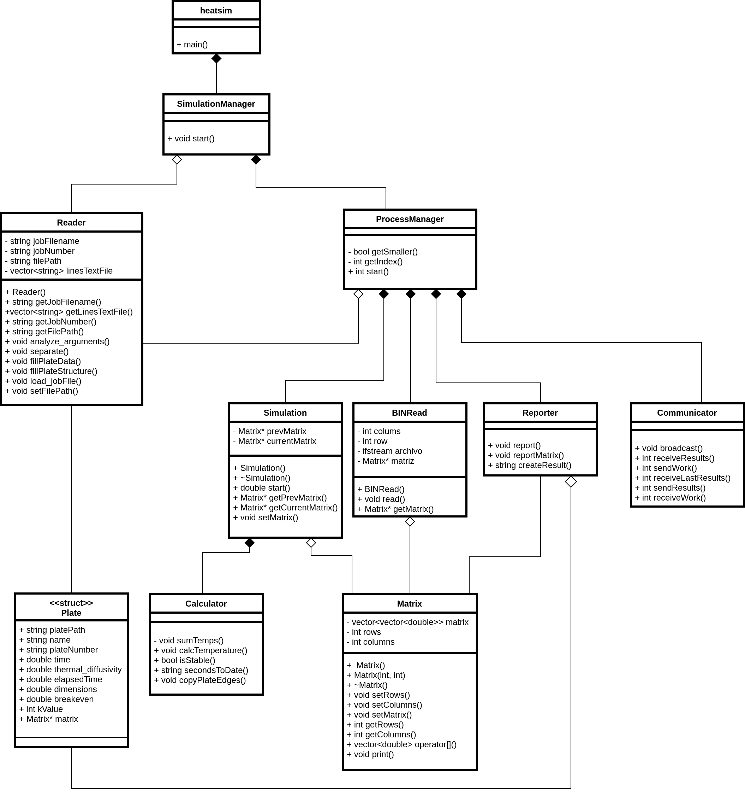

# Proyecto02: Transferencia de calor

## Descripción general del diseño

Este proyecto desarrolla un programa que permite simular la transferencia que sucede en una placa, del material que sea, aplicando una fórmula que depende del tiempo transcurrido y de la difusividad térmica de la placa usada (el material del que está hecha la placa). Se utiliza una solución paralela mediante OpenMP, con un mapeo estático por bloque además de implentar tecnología MPI para hacer de éste un programa distribuido. En este documento se explicará el diseño y el funcionamiento general del programa.

Transferencia de calor se ejecuta desde la clase heatsim el cuál hace el llamado a los métodos que permiten extraer la información recibida por argumentos y apartir de ellas ejecuta los cálculos de cada plate de forma distribuida y concurrente hasta que los cambios de temperaturas entre un estado y el siguiente sean menores a un epsilon (uno de los argumentos) y posteriormente escribe un reporte con los datos de la simulasión.

---

Para un mayor comprendimiento del programa véase el diseño UML:

o profundice en el pseudocódigo:

[pseudo-código](../design/process_manager.pseudo)

---

## Descripción de los módulos

### **heatSim**

Contiene el controlador del programa, se encarga de extraer, validar y posteriormente asignar los datos de la placa y de ejecución solicitados. Al controlar el flujo del programa, también hace llamado a los métodos que ejecutan los cálculos de las temperaturas, guarda los resultados de estos cálculos y los escribe en los archivos respectivos.

### **SimulationManager**

Clase que se encarga de abrir el archivo de trabajo, analizar sus argumentos y llamar al manager para iniciar las simulaciones

### **Reader**

Se encarga de leer y validar los argumentos. Puesto que el programa recibe hasta 4 argumentos, y que se pueden omitir hasta dos, Reader está implementado para revisar cada caso y actuar de la manera que corresponda.

### **Process Manager**

Esta clase contiene los métodos que crean archivos y variables necesarios para la distribuyen del trabajo asignado en el Job File a cada uno de los nodos. así como métodos utilitarios que se utilizan para extraer información de las láminas.

### **BINRead**

Se encarga de leer el archivo que se pasó mediante una ruta en los argumentos, extrae los datos sobre la matriz (cantidad de filas, columnas) así como crear la matriz y asignarle los valores correspondientes. Una vez termina devuelve dicha matriz para ser utilizada por el controlador.

### **Simulation**

Llama a los métodos de Calculator, ejecutando las simulaciones de transferencia de calor en la placa hasta que la placa alcance estabilidad. Intercambia cada uno de los estados de la matriz cada vez que se ejecuta el cálculo de las temperaturas en cada estado de la matriz.

### **Plate**

Estructura que almacena la información de cada lámina, esto con el fin de poder acceder a ella fácilmente, individualizando cada caso. La información almacenada representa el nombre, la ruta, el número, el tiempo de entre cambio de estados, la difusividad térmica, punto de equilibrio, la cantida de estados, tamaño de las dimensiones y la matriz contenida en el binario.

### **Calculator**

Contiene métodos auxiliares y los que calculan los cambios de temperatura celda por celda y de toda la placa. Normalmente se solicitan por parámetro dos matrices, una matriz con los datos del estado anterior y otra matriz donde se agregan los datos actualizados.

Dado que los temperatura en los bordes es constante, se decide actualizar solo los datos internos, mientras que los bordes se copian del estado anterior al actual.

### **Matrix**

Matrix es una clase propia que implementa un vector de dos dimensiones, la cuál se utiliza para guardar los estados de la placa dentro del programa, también para actualizar los datos de la temperatura y en parámetros de algunos métodos. Se implementan métodos de get y set, así como una sobrecarga al operator= para comodidad a la hora de copiar los datos de una matriz a otra.

### **Reporter**

Crea un documento que contendrá los resultados de la simulación, dicho archivo se crea en la ruta de trabajo. Dicho documento contendrá la información obtenida para la ejecución de cada uno de las placas que se solicitaron en cada uno de los trabajos.

### **Communicator**

Clase encargada de enviar y recibir los mensajes entre procesos de la tecnología MPI, se trate de comunicación punto a punto o colectiva.

---

Otras rutas:

[README del proyecto](../README.md)
